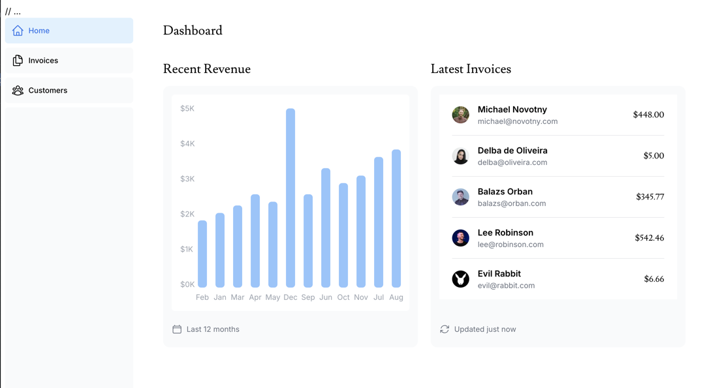

## Project Objectives

Learn the basics of nextjs by making a dashboard application.



---

## Running with Docker Compose

This project includes a `docker-compose.yml` for easy local development.

### Start the app and database

```sh
docker-compose up --build
```

- App: http://localhost:3000
- Database: localhost:5432 (user: postgres, password: postgres)

### Reset the database (wipe all data)

```sh
docker-compose down -v && docker-compose up --build
```

This will remove all data and start fresh.
